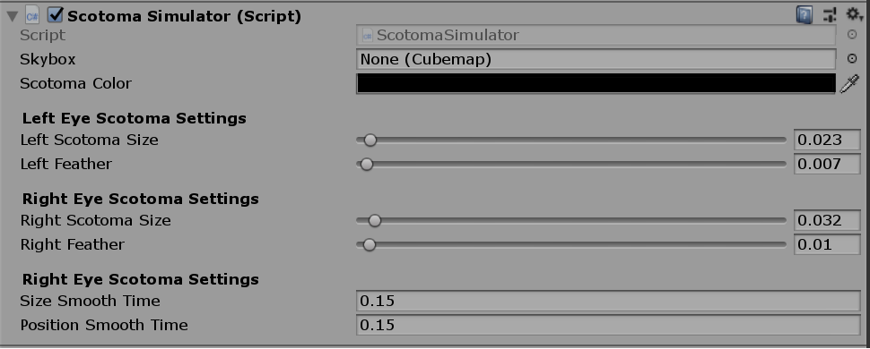

# Scotoma Simulator

I have created the shader and script needed to simulate two scotomas (one for each eye) rendered as post render effects. Implmenting them as post render effects allows the scotomas to be rendered after everything is rendered and appear as if they are in or very close to the users eye. 

Ths shader and the attached script allows us to have granular control of the scotomas' behaviour including their size, feathering effect (so their edges appear natural), movement and color. You can also add custom behaviours, for instance showing them only when they overlap, just by manipulating the effect size.



All you need to do to allow the scotomas to move with your eyes is to modify the following lines of code in the ScotomaSimulator.cs file.

```c#
//Eye positions in normalized screen coordinates. You need to update these values from your eye tracker.
_leftEyePosition = new Vector2(0.5f,0.5f);
_rightEyePosition = new Vector2(0.5f,0.5f);
```


