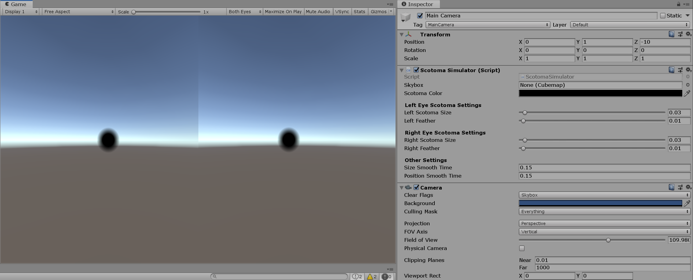

# Scotoma Simulator

This repo contains the shader and script needed to simulate two macular degenration scotomas (one for each eye) rendered as post render effects. Implementing them as post render effects allows the scotomas to be rendered after everything is rendered and appear as if they are in or very close to the user's eye. This code was developed as part of a larger project that investigates VR based intervention for macular degeration.



Ths shader and the attached script allow us to have granular control of the scotomas' behaviour including their size, feathering effect (so their edges appear soft and natural), movement and color. The behaviour of the scotomas can be manipulated separately for each eye, or if you chose so, together for both eyes. Together, the above features allow you to customize the scotomas for each user, or even manipulate the behaviour of scotomas in the middle of an experiment. Moreover, you can add custom behaviours without the need to do big changes, for instance, showing scotomas only when they overlap can be implemented by manipulating the effect size in a single if block that checks the position of the two eyes.

## Installation

To use the ScotomaSimulator, just download it and copy the assets folder to your projects assets folder. Then, add the ScotomaSimulator.cs script to your main camera. Done!

## Usage

Most of the scotomas behaviours can be manipulated from the GUI without writting too much code.


The scotoma size controls the size of your scotoma (separate for each eye). The size controls the radius of the circular scotoma and is expressed as a fraction of the field of view. 

The feather settings allows the scotomas to have feathered edges (linear change in opacity of the edges), instead of having hard edges. This allows them to look more natural. The feather size is also expressed as a fraction of the fild of view. The feather is added both to the inside and outside of the circular scotoma, for example: a feather size of 0.1 and scotoma size of 0.4 would give a scotoma that has a size of 0.5, where the outer region of size 0.2 comprises of the feathered edges. 

The scotoma color can be changed by changing the scotoma color settings. You can also create a Cubemap and attach it to the Skybox settings if you want the scotoma to change color based on the background. For the scotoma color settings to work, the Skybox setting must be blank.

To allow the scotomas to move with the user's eyes, all you need to do is to just modify the following lines of code in the Update method of the ScotomaSimulator class.

```c#
//Eye positions in normalized screen coordinates. You need to update these values from your eye tracker.
_leftEyePosition = new Vector2(0.5f,0.5f);
_rightEyePosition = new Vector2(0.5f,0.5f);
```

These two lines should be updated using the normalized eye coordinates from PupilLabs (or any other eye tracker). 

